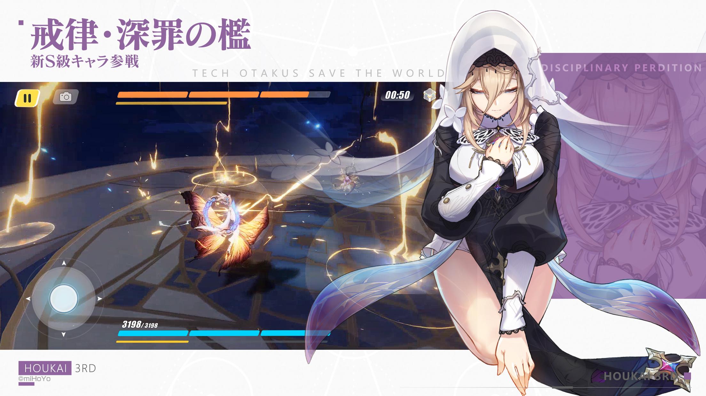

<div align="center">



# AponiaJS

### Nest-inspired structure. Elysia-native runtime. Bun from end to end.

A small TypeScript framework for building modular Bun applications with
controllers, dependency injection, and direct access to Elysia.

[](https://github.com/aponiajs/aponiajs/actions/workflows/ci.yml)
[](https://www.npmjs.com/package/@aponiajs/common)
[](https://bun.sh)
[](https://elysiajs.com)
[](./LICENSE)

[Get started](#get-started) · [CLI](#cli) · [Packages](#packages) ·
[Documentation](#documentation)

<sub>Experimental · Not recommended for production yet</sub>

</div>

## Why AponiaJS?

AponiaJS combines the application structure familiar from
[NestJS](https://nestjs.com) with the lightweight Bun-native runtime of
[Elysia](https://elysiajs.com).

- **Organized by design** — modules, controllers, services, and explicit
  dependency boundaries.
- **Bun-first** — Bun is the runtime, package manager, test runner, and
  documented toolchain.
- **Elysia-native** — decorated routes compile directly to Elysia, while native
  plugins remain available.
- **Small public surface** — framework packages have focused responsibilities
  and synchronized versions.
- **Useful diagnostics** — module cycles, missing exports, duplicate providers,
  and ambiguous dependencies fail with clear errors.

## Get started

### Requirements

- [Bun 1.3.14](https://bun.sh) or a compatible newer release.
- TypeScript with decorators enabled. Generated projects include the required
  configuration.

Create and run a new application:

```bash
bun create aponia my-api
cd my-api
bun run dev
```

The generated application starts on `http://localhost:3000`.

To install the framework into an existing Bun project:

```bash
bun add @aponiajs/common @aponiajs/platform-elysia elysia
```

## A complete application

```ts
import { Controller, Get, Injectable, Module } from "@aponiajs/common";
import { AponiaFactory } from "@aponiajs/platform-elysia";

@Injectable()
class GreetingService {
  greet(): string {
    return "Hello, AponiaJS!";
  }
}

@Controller("greetings")
class GreetingController {
  constructor(private readonly greetingService: GreetingService) {}

  @Get()
  getGreeting(): string {
    return this.greetingService.greet();
  }
}

@Module({
  controllers: [GreetingController],
  providers: [GreetingService],
})
class AppModule {}

const application = await AponiaFactory.create(AppModule);
await application.listen(Number(Bun.env.PORT ?? 3000));
```

```bash
curl http://localhost:3000/greetings
```

```text
Hello, AponiaJS!
```

Supported route decorators are `@Get()`, `@Post()`, `@Put()`, `@Patch()`, and
`@Delete()`. Providers may be classes, values, factories, or aliases, with
explicit tokens available for interfaces and configuration.

## CLI

The published CLI follows the built-in Nest generator catalog while producing
Aponia-specific Bun applications.

```bash
bun add --dev @aponiajs/cli

bunx aponia new my-api
bunx aponia generate module users
bunx aponia generate controller users
bunx aponia generate service users
bunx aponia generate resource users --type rest
```

Short aliases are supported:

```bash
bunx aponia g mo users
bunx aponia g co users
bunx aponia g s users
bunx aponia g res users
```

The CLI includes application, library, class, controller, decorator, filter,
gateway, guard, interface, interceptor, middleware, module, pipe, provider,
resolver, resource, and service generators. `router`, `routers`, and `route`
are aliases for `controller`.

See the [CLI guide](./docs/cli.md) for project selection, module registration,
resource transports, dry runs, and generator defaults.

## Architecture

```text
@aponiajs/common
        │
        ▼
 @aponiajs/core
        │
        ▼
@aponiajs/platform-elysia ───▶ Elysia
```

- `common` defines decorators, provider contracts, tokens, errors, and logging.
- `core` compiles the module graph and resolves singleton dependencies.
- `platform-elysia` maps controllers to HTTP routes and owns application
  lifecycle.

When a route needs native Elysia schemas, hooks, state, decorators, or plugins,
use `defineElysiaController()` as the platform escape hatch. The framework does
not hide the underlying Elysia application.

## Packages

All public packages are published to npm with synchronized versions. The badges
below resolve directly from the registry.

| Package                                                                                | Latest                                                                                                                        | Purpose                                    | Install                                    |
| -------------------------------------------------------------------------------------- | ----------------------------------------------------------------------------------------------------------------------------- | ------------------------------------------ | ------------------------------------------ |
| [`@aponiajs/common`](https://www.npmjs.com/package/@aponiajs/common)                   | [](https://www.npmjs.com/package/@aponiajs/common)                   | Decorators, contracts, tokens, and logging | `bun add @aponiajs/common`                 |
| [`@aponiajs/core`](https://www.npmjs.com/package/@aponiajs/core)                       | [](https://www.npmjs.com/package/@aponiajs/core)                       | Module graph and dependency injection      | `bun add @aponiajs/core`                   |
| [`@aponiajs/platform-elysia`](https://www.npmjs.com/package/@aponiajs/platform-elysia) | [](https://www.npmjs.com/package/@aponiajs/platform-elysia) | Elysia adapter and application lifecycle   | `bun add @aponiajs/platform-elysia elysia` |
| [`@aponiajs/cli`](https://www.npmjs.com/package/@aponiajs/cli)                         | [](https://www.npmjs.com/package/@aponiajs/cli)                         | Project and component generators           | `bun add --dev @aponiajs/cli`              |
| [`create-aponia`](https://www.npmjs.com/package/create-aponia)                         | [](https://www.npmjs.com/package/create-aponia)                             | `bun create` entrypoint                    | `bun create aponia my-api`                 |

The reserved `aponiajs` facade is private and should not be installed. See the
[package catalog](./docs/packages.md) for exports and package boundaries.

## Project status

AponiaJS currently provides:

- decorated modules, controllers, services, and constructor injection;
- HTTP route mapping and an Elysia-native controller escape hatch;
- singleton class, value, factory, alias, and explicit-token providers;
- module imports, provider exports, lifecycle management, and structured
  logging;
- project, component, and resource generators;
- Bun and Vite+ compatibility test lanes.

The following areas are not implemented yet:

- request parameter decorators and validation pipes;
- guards, interceptors, middleware, and exception filters at runtime;
- request and transient provider scopes;
- testing modules and provider overrides;
- OpenAPI, authentication, WebSockets, and microservice transports.

Review the [roadmap](./plans/npm-package-architecture-roadmap.md) before adopting
the framework for long-lived or production workloads.

## Development

```bash
bun install
bun run check
bun test
bun run test:vite-plus
bun run build
```

Run the repository example with:

```bash
bun run example:basic
```

Every push must include a synchronized
[Semantic Version](https://semver.org) increase:

```bash
bun run version:patch
# or: bun run version:minor
# or: bun run version:major
```

See [AGENTS.md](./AGENTS.md) for repository rules and
[the release guide](./docs/releasing.md) for the complete release workflow.

## Documentation

- [Architecture and style](./docs/architecture-and-style.md)
- [CLI reference](./docs/cli.md)
- [Logging](./docs/logging.md)
- [Package catalog](./docs/packages.md)
- [Releasing](./docs/releasing.md)

## Contributing and security

Contributions are welcome. Use a dedicated feature branch, keep repository
content in English, prefer maintained libraries over handwritten
general-purpose utilities, and add tests for behavioral changes.

AponiaJS has not completed a production security review. It does not currently
provide authentication, authorization, input validation, rate limiting, secret
management, or hardened production defaults.

## License and credits

AponiaJS is available under the [MIT License](./LICENSE).

The header uses in-game imagery of Aponia from _Honkai Impact 3rd_. All game
imagery belongs to its respective copyright holders. AponiaJS is independently
developed and is not affiliated with HoYoverse, miHoYo, NestJS, or Elysia.
