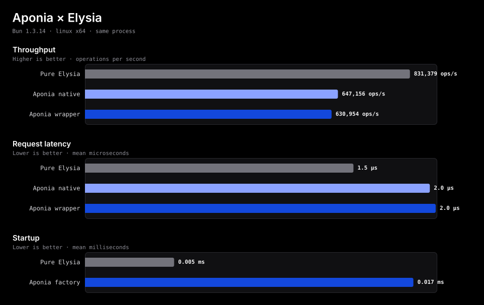

<div align="center">


# AponiaJS

Structured applications for Bun

[Documentation](./docs/architecture-and-style.md) ·
[CLI](./docs/cli.md) ·
[Packages](./docs/packages.md) ·
[Roadmap](./plans/npm-package-architecture-roadmap.md)

[](https://github.com/aponiajs/aponiajs/actions/workflows/ci.yml)
[](https://www.npmjs.com/package/@aponiajs/common)
[](https://bun.sh)
[](https://elysiajs.com)
[](./LICENSE)

Nest-inspired TypeScript architecture with dependency injection, decorated
controllers, and direct access to Elysia. Supercharged by Bun.

<sub>Experimental software · Not recommended for production yet</sub>

</div>

## Start

Create a Bun application:

```bash
bun add --global @aponiajs/cli
aponia new my-api
cd my-api
bun run dev
```

Or add AponiaJS to an existing project:

```bash
bun add @aponiajs/common @aponiajs/platform-elysia elysia
```

```ts
import { Controller, Get, Injectable, Module } from "@aponiajs/common";
import { AponiaFactory } from "@aponiajs/platform-elysia";

@Injectable()
class GreetingService {
  greet(): string {
    return "Hello, AponiaJS!";
  }
}

@Controller("greetings")
class GreetingController {
  constructor(private readonly greetingService: GreetingService) {}

  @Get()
  getGreeting(): string {
    return this.greetingService.greet();
  }
}

@Module({
  controllers: [GreetingController],
  providers: [GreetingService],
})
class AppModule {}

const application = await AponiaFactory.create(AppModule);
await application.listen(3000);
```

## Why AponiaJS?

- **Familiar structure** — modules, controllers, services, and explicit
  dependency boundaries inspired by NestJS.
- **Bun from end to end** — runtime, package manager, test runner, and every
  public command use Bun.
- **Elysia without a wall** — decorated routes map to Elysia while native
  schemas, hooks, state, and plugins remain available.
- **Actionable diagnostics** — module cycles, missing exports, duplicate
  providers, and ambiguous dependencies fail clearly.

## Performance, measured

The benchmark separates the cost of Aponia route registration from the
near-zero forwarding cost of `AponiaElysiaApplication.handle()`. Startup is
measured separately from the hot request path.

<div align="center">



</div>

Results are a machine-specific baseline, not a universal performance claim.
On the committed Bun 1.3.14 baseline:

| Comparison                            | Result                                |
| ------------------------------------- | ------------------------------------- |
| Wrapper vs Aponia native latency      | `+1.71%`                              |
| Full Aponia vs pure Elysia latency    | `+30.63%`                             |
| Full Aponia vs pure Elysia throughput | `-24.11%`                             |
| Aponia vs Elysia startup              | `0.017 ms` vs `0.005 ms` (`+268.30%`) |

The forwarding wrapper itself is small; most measured hot-path difference is
present before that final method call. Startup has a larger percentage change
but remains a one-time difference measured in hundredths of a millisecond.

Review the [methodology and reproduction commands](./benchmarks/README.md) or
the [JSON baseline](./.ecc/benchmarks/elysia-overhead.json).

## Generate

Install the published CLI and generate components with Nest-style commands:

```bash
bun add --global @aponiajs/cli

aponia new my-api
aponia generate module users
aponia generate controller users
aponia generate service users
aponia generate resource users --type rest
```

Short aliases work too:

```bash
aponia g mo users
aponia g co users
aponia g s users
aponia g res users
```

The catalog includes application, library, class, controller, decorator,
filter, gateway, guard, interface, interceptor, middleware, module, pipe,
provider, resolver, resource, and service generators. `router`, `routers`, and
`route` are controller aliases. See the [complete CLI reference](./docs/cli.md)
for options, module registration, transports, and dry runs.

## Packages

| Package                                                                                | Version                                                                                                                       | Purpose                                    |
| -------------------------------------------------------------------------------------- | ----------------------------------------------------------------------------------------------------------------------------- | ------------------------------------------ |
| [`@aponiajs/common`](https://www.npmjs.com/package/@aponiajs/common)                   | [](https://www.npmjs.com/package/@aponiajs/common)                   | Decorators, contracts, tokens, and logging |
| [`@aponiajs/core`](https://www.npmjs.com/package/@aponiajs/core)                       | [](https://www.npmjs.com/package/@aponiajs/core)                       | Module graph and dependency injection      |
| [`@aponiajs/platform-elysia`](https://www.npmjs.com/package/@aponiajs/platform-elysia) | [](https://www.npmjs.com/package/@aponiajs/platform-elysia) | Elysia adapter and application lifecycle   |
| [`@aponiajs/cli`](https://www.npmjs.com/package/@aponiajs/cli)                         | [](https://www.npmjs.com/package/@aponiajs/cli)                         | Project and component generators           |
| [`create-aponia`](https://www.npmjs.com/package/create-aponia)                         | [](https://www.npmjs.com/package/create-aponia)                             | `bun create` entrypoint                    |

All public packages use synchronized versions. The reserved `aponiajs` facade
is private and should not be installed.

## Current scope

AponiaJS currently supports decorated modules and HTTP controllers, singleton
dependency injection, class/value/factory/alias providers, explicit tokens,
module imports and exports, lifecycle management, structured logging, project
generators, and an Elysia-native controller escape hatch.

Request decorators, validation pipes, runtime guards and interceptors,
middleware, exception filters, provider scopes, testing modules, OpenAPI,
authentication, WebSockets, and microservice transports are not implemented
yet. Review the [roadmap](./plans/npm-package-architecture-roadmap.md) before
adopting the framework for long-lived workloads.

## Develop

The repository uses Bun 1.3.14, managed through mise:

```bash
mise install
bun install
bun run check
bun test
bun run test:vite-plus
bun run build
```

Every push must include a synchronized
[Semantic Version](https://semver.org) increase:

```bash
bun run version:patch
# or: bun run version:minor
# or: bun run version:major
```

Read the [release guide](./docs/releasing.md) for the enforced hook and CI
workflow. Repository conventions live in [AGENTS.md](./AGENTS.md).

## License

AponiaJS is available under the [MIT License](./LICENSE).

The header features Aponia from _Honkai Impact 3rd_. Game imagery belongs to its
respective copyright holders. AponiaJS is independently developed and is not
affiliated with HoYoverse, miHoYo, Bun, Elysia, or NestJS.
