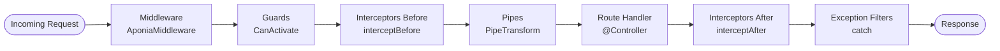

# Aponia Middleware and Pipes System — Design Specification

## Overview

This specification introduces two core NestJS-aligned runtime capabilities to AponiaJS:

1. **Pipes System (`PipeTransform`, `@UsePipes()`, built-in transformation/validation pipes)**:
   Performs parameter-level and method-level value transformation and validation before handler invocation.
2. **Middleware System (`AponiaMiddleware`, `MiddlewareConsumer`, module `configure()` seam)**:
   Executes before route matching, route guards, and enhancers, allowing request inspection, tracing, modification, and short-circuiting.

Both systems operate with Aponia's descriptor-first, ahead-of-time compilation philosophy, maintaining zero runtime overhead for routes that do not utilize pipes or middleware.

---

## Architecture & Execution Order

The enhancer lifecycle order is specified in `docs/enhancers.md`:



1. **Middleware Phase**: Runs earliest. Can modify request context or short-circuit.
2. **Guards Phase**: Route access authorization (`CanActivate`).
3. **Interceptors (Before)**: Pre-processing hooks (`interceptBefore`).
4. **Pipes Phase**: Validates and transforms route arguments just before invoking controller handlers.
5. **Route Handler**: Controller business logic.
6. **Interceptors (After)**: Post-processing response manipulation (`interceptAfter`).
7. **Exception Filters**: Catch unhandled errors and convert to RFC 9457 Problem Details.

---

## 1. Pipes Architecture

### Contracts in `@aponiajs/common`

```ts
export type ArgumentType = "body" | "query" | "param" | "headers" | "cookie" | "custom";

export interface ArgumentMetadata {
  readonly type: ArgumentType;
  readonly metatype?: ClassToken<unknown>;
  readonly data?: string;
}

export interface PipeTransform<TInput = unknown, TOutput = unknown> {
  transform(value: TInput, metadata: ArgumentMetadata): TOutput | Promise<TOutput>;
}

export type PipeType = PipeTransform | ClassToken<PipeTransform>;
```

### Parameter Decorators Integration

Parameter decorators (`@Param()`, `@Query()`, `@Body()`) accept trailing pipes:

```ts
@Get(":id")
findOne(@Param("id", ParseIntPipe) id: number) {}

@Get()
search(@Query("active", new DefaultValuePipe(true), ParseBoolPipe) active: boolean) {}
```

Method and Controller level pipes can also be specified using `@UsePipes()`:

```ts
@UsePipes(ValidationPipe)
@Post()
create(@Body() dto: CreateUserDto) {}
```

### Built-in Pipes

1. **`ParseIntPipe`**:
   - Parses string into integer (`parseInt(value, 10)`).
   - Throws 400 Bad Request if parsing fails (`Number.isNaN`).
2. **`ParseFloatPipe`**:
   - Parses string into float (`parseFloat(value)`).
   - Throws 400 Bad Request if parsing fails.
3. **`ParseBoolPipe`**:
   - Parses boolean strings (`"true"`, `"false"`, `"1"`, `"0"`).
   - Throws 400 Bad Request if invalid.
4. **`ParseUUIDPipe`**:
   - Validates UUID v4 string format via standard regex.
   - Throws 400 Bad Request if invalid.
5. **`DefaultValuePipe`**:
   - Supplies a default fallback value when incoming parameter is `undefined` or `null`.

---

## 2. Middleware Architecture

### Contracts in `@aponiajs/common`

```ts
export interface AponiaMiddleware {
  use(context: RouteContext, next: () => unknown | Promise<unknown>): unknown | Promise<unknown>;
}

export interface MiddlewareConsumer {
  apply(...middleware: (ClassToken<AponiaMiddleware> | AponiaMiddleware)[]): MiddlewareConfigProxy;
}

export interface MiddlewareConfigProxy {
  exclude(...routes: (string | { path: string; method?: RequestMethod })[]): MiddlewareConfigProxy;
  forRoutes(
    ...routes: (string | ClassToken<unknown> | { path: string; method?: RequestMethod })[]
  ): MiddlewareConsumer;
}

export interface AponiaModule {
  configure?(consumer: MiddlewareConsumer): void;
}
```

### Execution Model in `@aponiajs/platform-elysia`

- Middleware executes at Elysia request lifecycle hook or onRequest hook before route execution.
- Middleware classes are resolved through the DI container (`AponiaContainer`), supporting dependency injection.
- Next handler invocation chains asynchronously.

---

## 3. Backward Compatibility & Performance Invariants

1. Routes without pipes run the direct compiled invoker without performance degradation.
2. Parameter caching and binding remains static at bootstrap.
3. All descriptors remain frozen and immutable.
4. Diagnostics code:
   - `INVALID_PIPE` when a pipe definition fails contract verification.
   - `INVALID_MIDDLEWARE` when a middleware definition cannot be resolved.
